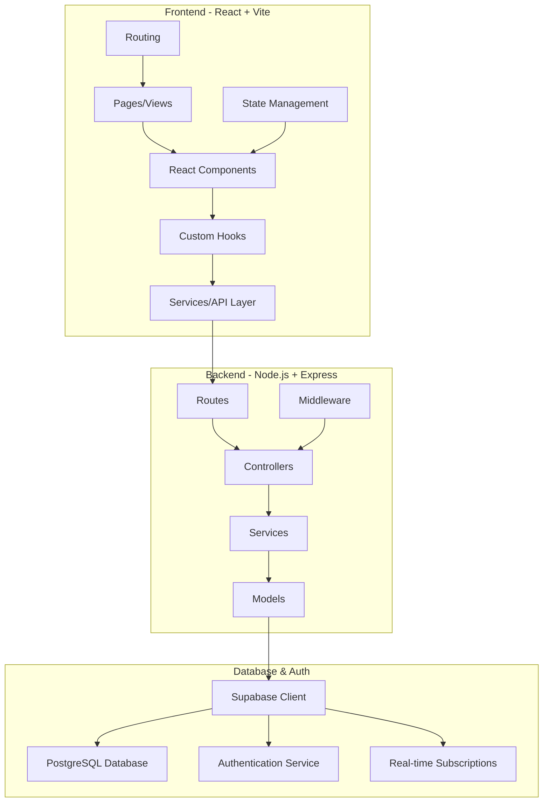
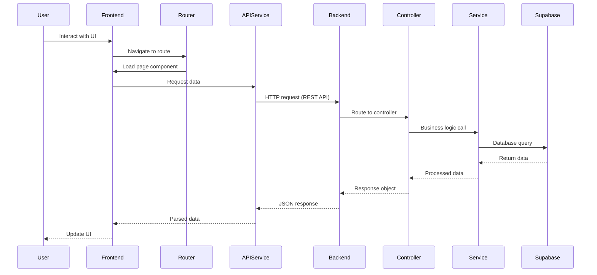

# Design Document: TRAINET Project Structure

## Overview

TRAINET is a graduate-level full-stack web application designed for training and educational purposes. The system follows modern web development best practices with a React-based frontend using Vite for optimal development experience and build performance, and a Node.js/Express backend implementing MVC architecture. The application is built using JavaScript (ES6+) with JSDoc for documentation and type hints, and integrates with Supabase for database management, authentication, and real-time capabilities, providing a scalable and maintainable foundation for a final-year software engineering project.

The architecture emphasizes separation of concerns, modularity, and industry-standard patterns to demonstrate professional software engineering practices suitable for academic evaluation and real-world deployment. While using JavaScript, the project maintains code quality through comprehensive JSDoc comments, PropTypes validation, ESLint configuration, and runtime validation libraries.

## Architecture



## Main Workflow



## Components and Interfaces

### Frontend Components

#### Component 1: Application Root

**Purpose**: Main application entry point managing global state, routing, and authentication context

**Interface**:
```javascript
/**
 * @typedef {Object} AppProps
 * @property {React.ReactNode} [children] - Child components
 */

/**
 * @typedef {Object} AppState
 * @property {boolean} isAuthenticated - Authentication status
 * @property {User|null} user - Current user object
 * @property {'light'|'dark'} theme - Current theme
 */
```

**Responsibilities**:
- Initialize application configuration
- Provide authentication context to child components
- Manage global theme and settings
- Handle top-level error boundaries


#### Component 2: Page Components

**Purpose**: Container components representing distinct application views/pages

**Interface**:
```javascript
/**
 * @typedef {Object} PageProps
 * @property {Object} [match] - Route match object
 * @property {Object} [location] - Location object
 * @property {Object} [history] - History object
 */

/**
 * @typedef {PageProps} DashboardPageProps
 * @property {string} userId - User ID
 */

/**
 * @typedef {PageProps} CoursePageProps
 * @property {string} courseId - Course ID
 */
```

**Responsibilities**:
- Fetch page-specific data on mount
- Compose smaller components into complete views
- Handle page-level state management
- Implement loading and error states

#### Component 3: Reusable UI Components

**Purpose**: Atomic, reusable components for consistent UI patterns

**Interface**:
```javascript
/**
 * @typedef {Object} ButtonProps
 * @property {'primary'|'secondary'|'danger'} variant - Button style variant
 * @property {'small'|'medium'|'large'} size - Button size
 * @property {Function} onClick - Click handler
 * @property {boolean} [disabled] - Disabled state
 * @property {React.ReactNode} children - Button content
 */

/**
 * @typedef {Object} CardProps
 * @property {string} title - Card title
 * @property {string} [subtitle] - Card subtitle
 * @property {React.ReactNode} children - Card content
 * @property {React.ReactNode} [actions] - Card actions
 */

/**
 * @typedef {Object} FormInputProps
 * @property {string} name - Input name
 * @property {string} type - Input type
 * @property {string} value - Input value
 * @property {Function} onChange - Change handler
 * @property {string} [error] - Error message
 * @property {string} label - Input label
 * @property {boolean} [required] - Required field
 */
```

**Responsibilities**:
- Provide consistent styling and behavior
- Handle accessibility requirements
- Emit events for parent components
- Validate input data


### Backend Components

#### Component 4: Express Application

**Purpose**: Main server application managing middleware, routes, and configuration

**Interface**:
```javascript
/**
 * @typedef {Object} ServerConfig
 * @property {number} port - Server port
 * @property {'development'|'production'|'test'} environment - Environment
 * @property {string[]} corsOrigins - Allowed CORS origins
 * @property {string} apiPrefix - API route prefix
 */

/**
 * @typedef {Object} ExpressApp
 * @property {Function} listen - Start server
 * @property {Function} use - Register middleware
 * @property {Function} get - Register GET route
 * @property {Function} post - Register POST route
 * @property {Function} put - Register PUT route
 * @property {Function} delete - Register DELETE route
 */
```

**Responsibilities**:
- Configure Express middleware stack
- Register API routes
- Handle global error handling
- Manage server lifecycle

#### Component 5: Controllers

**Purpose**: Handle HTTP requests, validate input, and coordinate service calls

**Interface**:
```javascript
/**
 * @typedef {Object} Controller
 * @property {Function} handleRequest - Handle HTTP request
 */

/**
 * @typedef {Controller} UserController
 * @property {Function} getUser - Get user by ID
 * @property {Function} createUser - Create new user
 * @property {Function} updateUser - Update user
 * @property {Function} deleteUser - Delete user
 */

/**
 * @typedef {Controller} CourseController
 * @property {Function} getCourses - Get all courses
 * @property {Function} getCourseById - Get course by ID
 * @property {Function} createCourse - Create new course
 * @property {Function} updateCourse - Update course
 * @property {Function} deleteCourse - Delete course
 */
```

**Responsibilities**:
- Parse and validate request parameters
- Call appropriate service methods
- Format response data
- Handle controller-level errors


#### Component 6: Services

**Purpose**: Implement business logic and interact with database layer

**Interface**:
```javascript
/**
 * @template T
 * @typedef {Object} Service
 * @property {Function} findAll - Find all records
 * @property {Function} findById - Find record by ID
 * @property {Function} create - Create new record
 * @property {Function} update - Update record
 * @property {Function} delete - Delete record
 */

/**
 * @typedef {Service<User>} UserService
 * @property {Function} findByEmail - Find user by email
 * @property {Function} authenticate - Authenticate user
 * @property {Function} updatePassword - Update user password
 */

/**
 * @typedef {Service<Course>} CourseService
 * @property {Function} findByInstructor - Find courses by instructor
 * @property {Function} enrollStudent - Enroll student in course
 * @property {Function} getEnrollments - Get course enrollments
 */
```

**Responsibilities**:
- Execute business logic
- Interact with Supabase client
- Transform data between layers
- Handle service-level validation

#### Component 7: Middleware

**Purpose**: Process requests before reaching controllers

**Interface**:
```javascript
/**
 * @typedef {Function} Middleware
 * @param {Object} req - Express request
 * @param {Object} res - Express response
 * @param {Function} next - Next middleware function
 * @returns {void|Promise<void>}
 */

/**
 * @typedef {Middleware} AuthMiddleware
 * @property {Function} verifyToken - Verify JWT token
 * @property {Function} requireRole - Require specific roles
 */

/**
 * @typedef {Middleware} ValidationMiddleware
 * @property {Function} validateBody - Validate request body
 * @property {Function} validateParams - Validate request params
 * @property {Function} validateQuery - Validate query params
 */

/**
 * @typedef {Middleware} ErrorMiddleware
 * @property {Function} handleError - Handle errors
 * @property {Function} notFound - Handle 404 errors
 */
```

**Responsibilities**:
- Authenticate and authorize requests
- Validate request data
- Log requests and responses
- Handle errors consistently


### Database & Integration Components

#### Component 8: Supabase Client

**Purpose**: Manage database connections and authentication with Supabase

**Interface**:
```javascript
/**
 * @typedef {Object} SupabaseClient
 * @property {Function} from - Query table
 * @property {Object} auth - Auth client
 * @property {Object} storage - Storage client
 * @property {Object} realtime - Realtime client
 */

/**
 * @typedef {Object} QueryBuilder
 * @property {Function} select - Select columns
 * @property {Function} insert - Insert data
 * @property {Function} update - Update data
 * @property {Function} delete - Delete data
 * @property {Function} eq - Equal filter
 * @property {Function} filter - Custom filter
 * @property {Function} order - Order results
 * @property {Function} limit - Limit results
 * @property {Function} single - Get single result
 */

/**
 * @typedef {Object} AuthClient
 * @property {Function} signUp - Sign up user
 * @property {Function} signIn - Sign in user
 * @property {Function} signOut - Sign out user
 * @property {Function} getUser - Get current user
 * @property {Function} onAuthStateChange - Auth state listener
 */
```

**Responsibilities**:
- Initialize Supabase connection
- Provide database query interface
- Manage authentication state
- Handle real-time subscriptions

## Data Models

### Model 1: User

```javascript
/**
 * @typedef {Object} User
 * @property {string} id - User ID (UUID)
 * @property {string} email - User email
 * @property {string} firstName - First name
 * @property {string} lastName - Last name
 * @property {'student'|'instructor'|'admin'} role - User role
 * @property {string} [avatar] - Avatar URL
 * @property {Date} createdAt - Creation timestamp
 * @property {Date} updatedAt - Update timestamp
 */
```

**Validation Rules**:
- email must be valid email format and unique
- firstName and lastName are required, 2-50 characters
- role must be one of the defined enum values
- avatar must be valid URL if provided


### Model 2: Course

```javascript
/**
 * @typedef {Object} Course
 * @property {string} id - Course ID (UUID)
 * @property {string} title - Course title
 * @property {string} description - Course description
 * @property {string} instructorId - Instructor user ID
 * @property {User} [instructor] - Instructor object
 * @property {string} category - Course category
 * @property {'beginner'|'intermediate'|'advanced'} level - Course level
 * @property {number} duration - Duration in hours
 * @property {string} [thumbnail] - Thumbnail URL
 * @property {boolean} isPublished - Published status
 * @property {Date} createdAt - Creation timestamp
 * @property {Date} updatedAt - Update timestamp
 */
```

**Validation Rules**:
- title is required, 5-200 characters
- description is required, 20-2000 characters
- instructorId must reference valid user with instructor role
- category is required
- level must be one of the defined enum values
- duration must be positive number
- thumbnail must be valid URL if provided

### Model 3: Enrollment

```javascript
/**
 * @typedef {Object} Enrollment
 * @property {string} id - Enrollment ID (UUID)
 * @property {string} courseId - Course ID
 * @property {Course} [course] - Course object
 * @property {string} studentId - Student user ID
 * @property {User} [student] - Student object
 * @property {Date} enrolledAt - Enrollment timestamp
 * @property {number} progress - Progress percentage (0-100)
 * @property {Date} [completedAt] - Completion timestamp
 * @property {'active'|'completed'|'dropped'} status - Enrollment status
 */
```

**Validation Rules**:
- courseId must reference valid course
- studentId must reference valid user with student role
- progress must be between 0 and 100
- status must be one of the defined enum values
- completedAt required when status is 'completed'

### Model 4: Lesson

```javascript
/**
 * @typedef {Object} Lesson
 * @property {string} id - Lesson ID (UUID)
 * @property {string} courseId - Course ID
 * @property {Course} [course] - Course object
 * @property {string} title - Lesson title
 * @property {string} content - Lesson content
 * @property {number} order - Lesson order
 * @property {number} duration - Duration in minutes
 * @property {string} [videoUrl] - Video URL
 * @property {Resource[]} [resources] - Lesson resources
 * @property {Date} createdAt - Creation timestamp
 * @property {Date} updatedAt - Update timestamp
 */
```

**Validation Rules**:
- courseId must reference valid course
- title is required, 5-200 characters
- content is required
- order must be positive integer
- duration must be positive number
- videoUrl must be valid URL if provided


## Algorithmic Pseudocode

### Main Processing Algorithm: User Authentication Flow

```javascript
/**
 * Authenticate user with credentials
 * @param {Object} credentials - User credentials
 * @param {string} credentials.email - User email
 * @param {string} credentials.password - User password
 * @returns {Promise<Object>} Authentication result
 */
async function authenticateUser(credentials) {
  // INPUT: credentials containing email and password
  // OUTPUT: AuthResult with token and user data or error
  
  // Precondition: credentials.email is valid email format
  // Precondition: credentials.password is non-empty string
  
  try {
    // Step 1: Validate input credentials
    const validationResult = validateCredentials(credentials);
    if (!validationResult.isValid) {
      return {
        success: false,
        error: validationResult.error
      };
    }
    
    // Step 2: Attempt authentication with Supabase
    const { data, error } = await supabase.auth.signIn({
      email: credentials.email,
      password: credentials.password
    });
    
    // Step 3: Handle authentication errors
    if (error) {
      return {
        success: false,
        error: 'Invalid credentials'
      };
    }
    
    // Step 4: Fetch user profile data
    const user = await fetchUserProfile(data.user.id);
    
    // Step 5: Generate session token
    const token = generateSessionToken(data.session);
    
    // Postcondition: result.success === true implies valid token and user data
    // Postcondition: result.success === false implies error message present
    
    return {
      success: true,
      token: token,
      user: user
    };
    
  } catch (error) {
    return {
      success: false,
      error: 'Authentication service unavailable'
    };
  }
}
```

**Preconditions:**
- credentials object is defined and non-null
- credentials.email is valid email format
- credentials.password is non-empty string
- Supabase client is initialized and connected

**Postconditions:**
- Returns AuthResult object
- If successful: result.success === true AND result.token is valid JWT AND result.user contains complete user data
- If failed: result.success === false AND result.error contains descriptive message
- No side effects on input credentials


### Course Enrollment Algorithm

```javascript
/**
 * Enroll student in course
 * @param {string} courseId - Course ID (UUID)
 * @param {string} studentId - Student ID (UUID)
 * @returns {Promise<Object>} Enrollment result
 */
async function enrollStudentInCourse(courseId, studentId) {
  // INPUT: courseId and studentId as UUID strings
  // OUTPUT: EnrollmentResult with enrollment data or error
  
  // Precondition: courseId references existing published course
  // Precondition: studentId references existing user with student role
  
  try {
    // Step 1: Validate course exists and is published
    const course = await courseService.findById(courseId);
    if (!course || !course.isPublished) {
      return {
        success: false,
        error: 'Course not available for enrollment'
      };
    }
    
    // Step 2: Validate student exists and has correct role
    const student = await userService.findById(studentId);
    if (!student || student.role !== 'student') {
      return {
        success: false,
        error: 'Invalid student'
      };
    }
    
    // Step 3: Check for existing enrollment
    const existingEnrollment = await enrollmentService.findByStudentAndCourse(
      studentId, 
      courseId
    );
    if (existingEnrollment) {
      return {
        success: false,
        error: 'Student already enrolled in this course'
      };
    }
    
    // Step 4: Create enrollment record
    const enrollment = await enrollmentService.create({
      courseId: courseId,
      studentId: studentId,
      enrolledAt: new Date(),
      progress: 0,
      status: 'active'
    });
    
    // Step 5: Send enrollment confirmation
    await notificationService.sendEnrollmentConfirmation(student.email, course.title);
    
    // Postcondition: enrollment record created with progress = 0 and status = 'active'
    // Postcondition: notification sent to student
    
    return {
      success: true,
      enrollment: enrollment
    };
    
  } catch (error) {
    return {
      success: false,
      error: 'Enrollment failed due to system error'
    };
  }
}
```

**Preconditions:**
- courseId is valid UUID format
- studentId is valid UUID format
- Course with courseId exists in database
- User with studentId exists with role 'student'
- Database connection is active

**Postconditions:**
- Returns EnrollmentResult object
- If successful: enrollment record created in database with initial progress 0
- If failed: no database changes made
- Notification sent only if enrollment successful


### Progress Tracking Algorithm

```javascript
/**
 * Update lesson progress for enrollment
 * @param {string} enrollmentId - Enrollment ID (UUID)
 * @param {string} lessonId - Lesson ID (UUID)
 * @param {boolean} completed - Completion status
 * @returns {Promise<Object>} Progress result
 */
async function updateLessonProgress(enrollmentId, lessonId, completed) {
  // INPUT: enrollmentId, lessonId, and completion status
  // OUTPUT: ProgressResult with updated progress percentage
  
  // Precondition: enrollmentId references active enrollment
  // Precondition: lessonId references lesson in enrolled course
  
  try {
    // Step 1: Fetch enrollment and validate
    const enrollment = await enrollmentService.findById(enrollmentId);
    if (!enrollment || enrollment.status !== 'active') {
      return {
        success: false,
        error: 'Invalid or inactive enrollment'
      };
    }
    
    // Step 2: Fetch lesson and validate it belongs to course
    const lesson = await lessonService.findById(lessonId);
    if (!lesson || lesson.courseId !== enrollment.courseId) {
      return {
        success: false,
        error: 'Lesson not found in enrolled course'
      };
    }
    
    // Step 3: Update or create progress record
    await progressService.upsert({
      enrollmentId: enrollmentId,
      lessonId: lessonId,
      completed: completed,
      completedAt: completed ? new Date() : null
    });
    
    // Step 4: Calculate overall course progress
    const totalLessons = await lessonService.countByCourse(enrollment.courseId);
    const completedLessons = await progressService.countCompleted(enrollmentId);
    const progressPercentage = Math.round((completedLessons / totalLessons) * 100);
    
    // Step 5: Update enrollment progress
    await enrollmentService.update(enrollmentId, {
      progress: progressPercentage
    });
    
    // Step 6: Check if course is completed
    if (progressPercentage === 100) {
      await enrollmentService.update(enrollmentId, {
        status: 'completed',
        completedAt: new Date()
      });
    }
    
    // Postcondition: progress percentage is between 0 and 100
    // Postcondition: if progress = 100, enrollment status = 'completed'
    
    return {
      success: true,
      progress: progressPercentage,
      isCompleted: progressPercentage === 100
    };
    
  } catch (error) {
    return {
      success: false,
      error: 'Failed to update progress'
    };
  }
}
```

**Preconditions:**
- enrollmentId is valid UUID
- lessonId is valid UUID
- Enrollment exists and is active
- Lesson belongs to the enrolled course

**Postconditions:**
- Progress record updated or created
- Enrollment progress percentage recalculated
- Progress percentage is always between 0 and 100 inclusive
- If progress reaches 100%, enrollment status changes to 'completed'
- completedAt timestamp set when status becomes 'completed'

**Loop Invariants:**
- N/A (no explicit loops in main logic)


## Key Functions with Formal Specifications

### Function 1: validateCredentials()

```javascript
/**
 * Validate user credentials
 * @param {Object} credentials - User credentials
 * @param {string} credentials.email - User email
 * @param {string} credentials.password - User password
 * @returns {Object} Validation result
 */
function validateCredentials(credentials)
```

**Preconditions:**
- credentials object is defined (not null/undefined)
- credentials has email and password properties

**Postconditions:**
- Returns ValidationResult object
- result.isValid === true if and only if email is valid format AND password length >= 8
- result.error contains descriptive message when isValid === false
- No mutations to input credentials

**Loop Invariants:** N/A

### Function 2: fetchUserProfile()

```javascript
/**
 * Fetch user profile by ID
 * @param {string} userId - User ID (UUID)
 * @returns {Promise<Object>} User object
 */
async function fetchUserProfile(userId)
```

**Preconditions:**
- userId is non-empty string in UUID format
- Database connection is active

**Postconditions:**
- Returns User object if user exists
- Throws UserNotFoundException if user not found
- Returned user object contains all required fields
- No side effects on database

**Loop Invariants:** N/A

### Function 3: generateSessionToken()

```javascript
/**
 * Generate JWT session token
 * @param {Object} session - Session object
 * @returns {string} JWT token
 */
function generateSessionToken(session)
```

**Preconditions:**
- session object is defined and contains valid session data
- session.user.id is valid UUID
- JWT secret is configured in environment

**Postconditions:**
- Returns valid JWT token string
- Token contains user ID and expiration time
- Token is signed with application secret
- Token expiration is set to configured duration

**Loop Invariants:** N/A

### Function 4: createCourse()

```javascript
/**
 * Create new course
 * @param {Object} courseData - Course data
 * @returns {Promise<Object>} Created course
 */
async function createCourse(courseData)
```

**Preconditions:**
- courseData is defined and validated
- courseData.instructorId references existing instructor user
- courseData.title is 5-200 characters
- courseData.description is 20-2000 characters

**Postconditions:**
- Returns created Course object with generated ID
- Course is persisted in database
- Course.isPublished is false by default
- Course.createdAt and updatedAt are set to current timestamp
- Instructor relationship is established

**Loop Invariants:** N/A


### Function 5: getCoursesByInstructor()

```javascript
/**
 * Get courses by instructor ID
 * @param {string} instructorId - Instructor ID (UUID)
 * @returns {Promise<Array>} Array of courses
 */
async function getCoursesByInstructor(instructorId)
```

**Preconditions:**
- instructorId is valid UUID format
- Database connection is active

**Postconditions:**
- Returns array of Course objects
- All returned courses have instructorId matching input
- Array is empty if no courses found (not null)
- Courses are ordered by createdAt descending
- No database modifications

**Loop Invariants:** N/A

### Function 6: updateEnrollmentProgress()

```javascript
/**
 * Update enrollment progress
 * @param {string} enrollmentId - Enrollment ID (UUID)
 * @param {number} progress - Progress percentage (0-100)
 * @returns {Promise<Object>} Updated enrollment
 */
async function updateEnrollmentProgress(enrollmentId, progress)
```

**Preconditions:**
- enrollmentId is valid UUID
- progress is number between 0 and 100 inclusive
- Enrollment exists in database

**Postconditions:**
- Returns updated Enrollment object
- Enrollment.progress equals input progress value
- Enrollment.updatedAt is updated to current timestamp
- If progress === 100, status changes to 'completed' and completedAt is set
- Database record is updated

**Loop Invariants:** N/A

## Example Usage

```javascript
// Example 1: User Authentication
const credentials = {
  email: "student@example.com",
  password: "securePassword123"
};

const authResult = await authenticateUser(credentials);

if (authResult.success) {
  console.log("Login successful");
  localStorage.setItem('token', authResult.token);
  // Redirect to dashboard
} else {
  console.error(authResult.error);
  // Show error message to user
}

// Example 2: Course Enrollment
const enrollmentResult = await enrollStudentInCourse(
  "course-uuid-123",
  "student-uuid-456"
);

if (enrollmentResult.success) {
  console.log("Enrolled successfully:", enrollmentResult.enrollment);
  // Update UI to show enrollment
} else {
  console.error(enrollmentResult.error);
  // Show error message
}

// Example 3: Progress Tracking
const progressResult = await updateLessonProgress(
  "enrollment-uuid-789",
  "lesson-uuid-101",
  true
);

if (progressResult.success) {
  console.log(`Course progress: ${progressResult.progress}%`);
  if (progressResult.isCompleted) {
    console.log("Congratulations! Course completed!");
  }
}
```


```javascript
// Example 4: React Component Usage
import { useState, useEffect } from 'react';
import { useAuth } from '@/hooks/useAuth';
import { courseService } from '@/services/courseService';

function DashboardPage() {
  const { user } = useAuth();
  const [courses, setCourses] = useState([]);
  const [loading, setLoading] = useState(true);

  useEffect(() => {
    async function loadCourses() {
      try {
        const data = await courseService.getAll();
        setCourses(data);
      } catch (error) {
        console.error('Failed to load courses:', error);
      } finally {
        setLoading(false);
      }
    }
    
    loadCourses();
  }, []);

  if (loading) return <LoadingSpinner />;

  return (
    <div className="dashboard">
      <h1>Welcome, {user?.firstName}!</h1>
      <CourseList courses={courses} />
    </div>
  );
}

// Example 5: Express Route Handler
import { Router } from 'express';
import { courseController } from '@/controllers/courseController';
import { authMiddleware } from '@/middleware/authMiddleware';
import { validateBody } from '@/middleware/validationMiddleware';
import { createCourseSchema } from '@/schemas/courseSchema';

const router = Router();

router.get(
  '/courses',
  authMiddleware.verifyToken,
  courseController.getCourses
);

router.post(
  '/courses',
  authMiddleware.verifyToken,
  authMiddleware.requireRole(['instructor', 'admin']),
  validateBody(createCourseSchema),
  courseController.createCourse
);

router.get(
  '/courses/:id',
  authMiddleware.verifyToken,
  courseController.getCourseById
);

export default router;
```

## Correctness Properties

### Property 1: Authentication Integrity
```javascript
// For all authentication attempts:
// ∀ credentials: SignInCredentials,
//   authenticateUser(credentials).success === true 
//   ⟹ ∃ user: User, user.email === credentials.email ∧ validPassword(user, credentials.password)

// Verification: Authentication succeeds if and only if valid user exists with matching credentials
```

### Property 2: Enrollment Uniqueness
```javascript
// For all enrollment operations:
// ∀ courseId, studentId,
//   enrollStudentInCourse(courseId, studentId).success === true
//   ⟹ ¬∃ enrollment: Enrollment, 
//       enrollment.courseId === courseId ∧ 
//       enrollment.studentId === studentId ∧
//       enrollment.status === 'active'

// Verification: Student cannot be enrolled in same course multiple times simultaneously
```


### Property 3: Progress Monotonicity
```javascript
// For all progress updates:
// ∀ enrollment: Enrollment, lesson: Lesson,
//   updateLessonProgress(enrollment.id, lesson.id, true)
//   ⟹ enrollment.progress_after >= enrollment.progress_before

// Verification: Completing lessons never decreases overall progress
```

### Property 4: Course Completion Consistency
```javascript
// For all enrollments:
// ∀ enrollment: Enrollment,
//   enrollment.progress === 100 ⟺ enrollment.status === 'completed'

// Verification: 100% progress always corresponds to completed status
```

### Property 5: Role-Based Access Control
```javascript
// For all protected operations:
// ∀ operation: ProtectedOperation, user: User,
//   canExecute(user, operation) === true
//   ⟹ user.role ∈ operation.allowedRoles

// Verification: Users can only execute operations allowed for their role
```

### Property 6: Data Validation Consistency
```javascript
// For all create/update operations:
// ∀ data: EntityData, entity: Entity,
//   create(data) OR update(entity.id, data)
//   ⟹ validate(data) === true

// Verification: Invalid data never persists to database
```

### Property 7: Session Token Validity
```javascript
// For all authenticated requests:
// ∀ request: Request,
//   isAuthenticated(request) === true
//   ⟹ ∃ token: JWT, 
//       token === request.headers.authorization ∧
//       isValid(token) ∧
//       ¬isExpired(token)

// Verification: Authenticated requests always have valid, non-expired tokens
```

## Error Handling

### Error Scenario 1: Authentication Failure

**Condition**: User provides invalid credentials or account doesn't exist
**Response**: Return 401 Unauthorized with descriptive error message
**Recovery**: 
- Log failed attempt for security monitoring
- Increment failed login counter
- Implement rate limiting after multiple failures
- Clear any existing session data
- Prompt user to retry or reset password

### Error Scenario 2: Database Connection Failure

**Condition**: Supabase client cannot establish connection or query times out
**Response**: Return 503 Service Unavailable
**Recovery**:
- Implement exponential backoff retry logic
- Log error with full context for debugging
- Return cached data if available
- Display user-friendly error message
- Attempt reconnection on next request


### Error Scenario 3: Validation Errors

**Condition**: Request data fails validation rules (missing fields, invalid format, constraint violations)
**Response**: Return 400 Bad Request with detailed validation errors
**Recovery**:
- Return specific field-level error messages
- Do not persist any data
- Log validation failure for analytics
- Highlight invalid fields in UI
- Preserve valid field values for user correction

### Error Scenario 4: Authorization Failure

**Condition**: Authenticated user attempts operation without required permissions
**Response**: Return 403 Forbidden
**Recovery**:
- Log unauthorized access attempt
- Do not reveal existence of protected resources
- Redirect to appropriate page based on user role
- Display permission denied message
- Suggest contacting administrator if needed

### Error Scenario 5: Resource Not Found

**Condition**: Requested resource (course, user, enrollment) doesn't exist
**Response**: Return 404 Not Found
**Recovery**:
- Log request for analytics
- Suggest similar or related resources
- Provide search functionality
- Redirect to listing page
- Clear any stale references in client state

### Error Scenario 6: Duplicate Resource Creation

**Condition**: Attempt to create resource that violates uniqueness constraints
**Response**: Return 409 Conflict with specific constraint violation
**Recovery**:
- Identify conflicting resource
- Suggest updating existing resource instead
- Provide link to existing resource
- Log duplicate attempt
- Clear form or suggest modifications

### Error Scenario 7: Rate Limit Exceeded

**Condition**: User exceeds allowed request rate
**Response**: Return 429 Too Many Requests with retry-after header
**Recovery**:
- Implement exponential backoff
- Display countdown timer to user
- Queue non-critical requests
- Log rate limit violations
- Consider upgrading user tier if applicable

## Testing Strategy

### Unit Testing Approach

**Framework**: Jest for both frontend and backend

**Coverage Goals**: Minimum 80% code coverage for all modules

**Key Test Cases**:
- Service layer: Test all CRUD operations with mocked database
- Controllers: Test request handling, validation, and response formatting
- Middleware: Test authentication, authorization, and validation logic
- Utilities: Test helper functions with edge cases
- Components: Test rendering, user interactions, and state changes

**Mocking Strategy**:
- Mock Supabase client for database operations
- Mock external API calls
- Mock authentication context in component tests
- Use test fixtures for consistent data


### Property-Based Testing Approach

**Property Test Library**: fast-check (JavaScript/TypeScript)

**Properties to Test**:

1. **Authentication Idempotency**: Multiple authentication attempts with same valid credentials always return same user data
2. **Progress Bounds**: Course progress always remains between 0 and 100 regardless of lesson completion sequence
3. **Enrollment Invariants**: Enrolling and unenrolling maintains database consistency
4. **Validation Consistency**: Any data that passes validation can be successfully persisted
5. **Token Generation**: Generated tokens are always valid and decodable

**Example Property Test**:
```javascript
import fc from 'fast-check';

describe('Course Progress Properties', () => {
  it('progress should always be between 0 and 100', () => {
    fc.assert(
      fc.property(
        fc.integer({ min: 0, max: 100 }),
        fc.integer({ min: 1, max: 50 }),
        async (completedLessons, totalLessons) => {
          const progress = calculateProgress(completedLessons, totalLessons);
          return progress >= 0 && progress <= 100;
        }
      )
    );
  });
});
```

### Integration Testing Approach

**Framework**: Supertest for API testing, React Testing Library for frontend integration

**Test Scenarios**:
- Complete user registration and login flow
- Course creation, enrollment, and progress tracking workflow
- Authentication token refresh and expiration handling
- Real-time updates via Supabase subscriptions
- File upload and storage operations
- Multi-step form submissions

**Database Strategy**:
- Use separate test database instance
- Reset database state between test suites
- Use database transactions for test isolation
- Seed test data consistently

## Performance Considerations

### Frontend Optimization
- Implement code splitting for route-based lazy loading
- Use React.memo for expensive component renders
- Implement virtual scrolling for long lists
- Optimize images with lazy loading and responsive sizes
- Cache API responses with React Query or SWR
- Minimize bundle size with tree shaking

### Backend Optimization
- Implement database query optimization with proper indexes
- Use connection pooling for Supabase client
- Implement caching layer (Redis) for frequently accessed data
- Use pagination for large result sets
- Implement request rate limiting
- Optimize N+1 queries with eager loading

### Database Optimization
- Create indexes on frequently queried columns (email, courseId, studentId)
- Use database views for complex queries
- Implement database-level constraints for data integrity
- Use Supabase real-time selectively to reduce overhead
- Optimize JSON column queries


## Security Considerations

### Authentication & Authorization
- Implement JWT-based authentication with secure token storage
- Use HTTP-only cookies for token storage to prevent XSS attacks
- Implement refresh token rotation
- Enforce strong password requirements (minimum 8 characters, complexity rules)
- Implement account lockout after failed login attempts
- Use bcrypt for password hashing (handled by Supabase)
- Implement role-based access control (RBAC) at API level

### Data Protection
- Validate and sanitize all user inputs
- Implement parameterized queries to prevent SQL injection (Supabase handles this)
- Use HTTPS for all communications
- Implement CORS with whitelist of allowed origins
- Encrypt sensitive data at rest
- Implement data retention and deletion policies
- Follow GDPR compliance for user data

### API Security
- Implement rate limiting per user/IP
- Use API versioning for backward compatibility
- Implement request size limits
- Validate content-type headers
- Implement CSRF protection for state-changing operations
- Log security events for audit trail
- Implement API key rotation for service accounts

### Frontend Security
- Implement Content Security Policy (CSP) headers
- Sanitize user-generated content before rendering
- Implement XSS protection
- Use secure dependencies and regular updates
- Implement subresource integrity for CDN resources
- Avoid storing sensitive data in localStorage
- Implement secure session management

## Dependencies

### Frontend Dependencies
- **React** (^18.2.0): UI library
- **React Router DOM** (^6.x): Client-side routing
- **Vite** (^4.x): Build tool and dev server
- **@supabase/supabase-js** (^2.x): Supabase client
- **React Query** or **SWR**: Data fetching and caching
- **Axios**: HTTP client
- **React Hook Form**: Form management
- **Zod** or **Joi**: Schema validation
- **prop-types**: React component prop validation
- **Tailwind CSS** or **Material-UI**: Styling framework
- **React Icons**: Icon library

### Backend Dependencies
- **Node.js** (^18.x): Runtime environment
- **Express** (^4.x): Web framework
- **@supabase/supabase-js** (^2.x): Supabase client
- **dotenv**: Environment configuration
- **cors**: CORS middleware
- **helmet**: Security headers
- **express-rate-limit**: Rate limiting
- **joi** or **zod**: Request validation
- **jsonwebtoken**: JWT handling
- **winston**: Logging
- **nodemon**: Development auto-reload

### Development Dependencies
- **Jest**: Testing framework
- **Supertest**: API testing
- **@testing-library/react**: React component testing
- **@testing-library/jest-dom**: DOM matchers
- **fast-check**: Property-based testing
- **ESLint**: Code linting
- **eslint-plugin-react**: React-specific linting rules
- **eslint-plugin-react-hooks**: React hooks linting
- **Prettier**: Code formatting
- **Husky**: Git hooks
- **lint-staged**: Pre-commit linting

### External Services
- **Supabase**: Database, authentication, and real-time subscriptions
- **Vercel** or **Netlify**: Frontend hosting (recommended)
- **Railway** or **Render**: Backend hosting (recommended)
- **Cloudinary** or **Supabase Storage**: Media file storage
